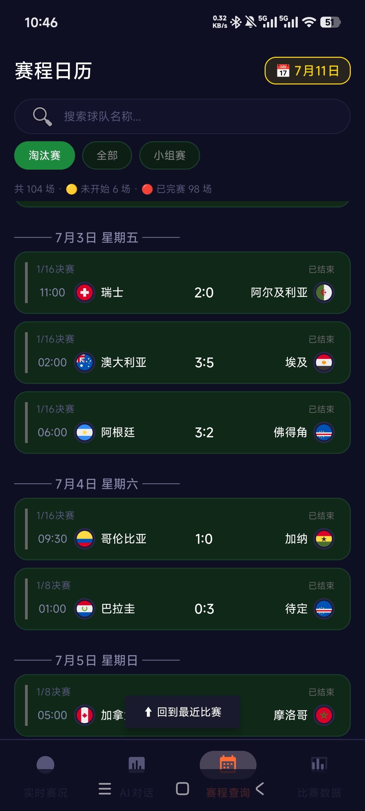
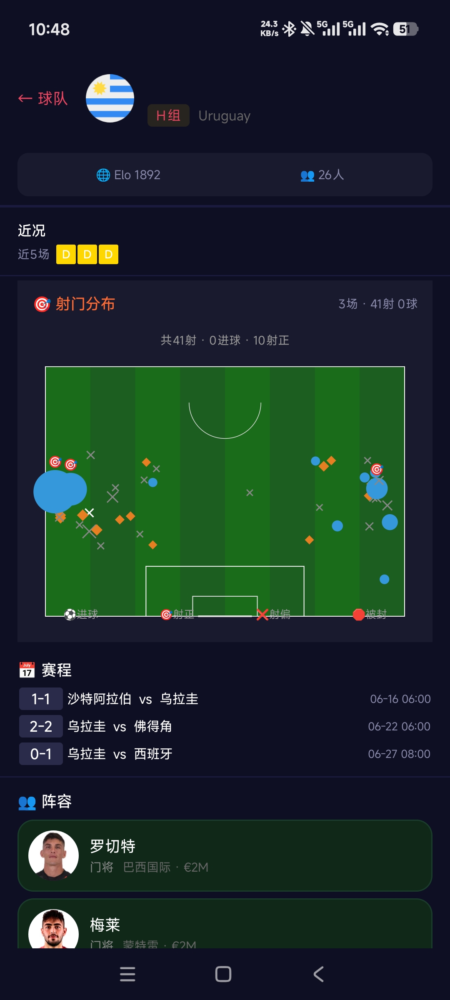
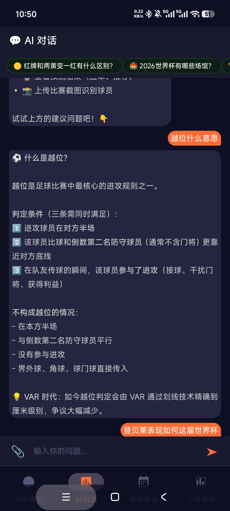
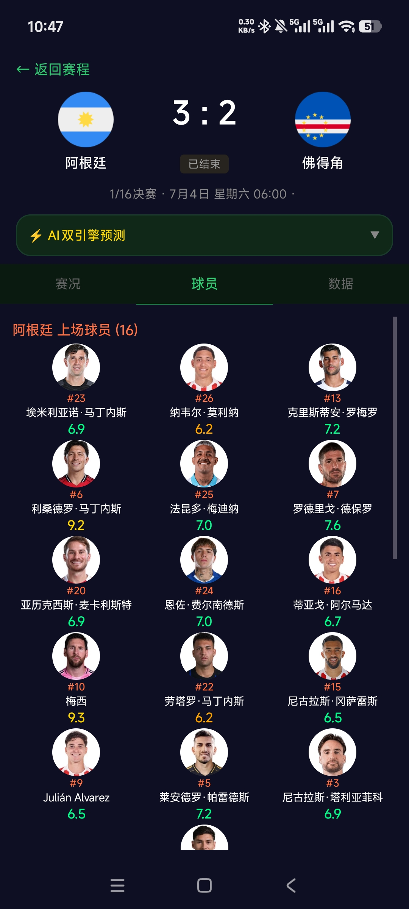

# ⚽ World Cup 2026 — Offline Companion App

[]()
[]()
[]()
[]()
[]()
[]()

### Android 原生世界杯观赛助手 | 全离线 · 5 Tab · 48 队 · 1246 名球员 · 104 场比赛

---

> 👨‍💻 **30 秒电梯演讲**：这是一款**全离线**的 Android 观赛 App。我独立完成了从技术验证、架构设计到数据管线的全流程。最初尝试做 AR 球衣识别验证——实验后证明手机端不可行，及时止损转向这个真正有价值的项目。代码 clone 即编译，您手机上用什么样，这个仓库就跑出什么样。

---

## 📱 Demo

<!-- 替换为你的截图路径 -->
<p align="center">
  
  
  
  
  
</p>

<!-- 替换为你的 GIF 路径 -->
<!-- <p align="center"></p> -->

---

## 🚀 Quick Start

**零配置开箱即用** — 不需要任何 API Key，clone 下来就能跑。

```bash
git clone https://github.com/LI-IIIJL/worldcup-2026.git
```

然后用 Android Studio → **File → Open** → 选 `worldcup-2026` 文件夹 → 等 Gradle Sync 完成 → 点 **Run ▶️**

> 首次打开 Android Studio 会自动创建 `local.properties`（SDK 路径），核心功能（赛程、球队百科、积分榜、AI FAQ）全部离线可用。不需要任何注册或配置。

<details>
<summary><b>高级：配置 API Keys（可选，仅实时比分/照片/AI 增强需要）</b></summary>

```bash
cp local.properties.example local.properties
# 编辑 local.properties，填入 Key（不需要的留空）
```

| Key | 用途 | 不配的话 |
|:----|:-----|:---------|
| `FOOTBALL_DATA_API_KEY` | 实时比分、积分榜 | 显示本地赛程（比分全是 0-0） |
| `API_SPORTS_KEY` | 球员照片、阵容 | 照片区域显示占位图 |
| `BALLDONTLIE_API_KEY` | 高级统计、射门图 | 该区域不显示数据 |
| `DEEPSEEK_API_KEY`（用 LongCat） | AI 对话增强 | AI 仍能回答 42 条本地 FAQ |

> 建议先跑起来看看，觉得有用再去申请。LongCat AI 每天免费 5M tokens。
</details>
| `FOOTBALL_DATA_API_KEY` | 实时比分、积分榜 | 显示本地赛程（比分全是 0-0） |
| `API_SPORTS_KEY` | 球员照片、阵容 | 照片区域显示占位图 |
| `BALLDONTLIE_API_KEY` | 高级统计、射门图 | 该区域不显示数据 |
| `DEEPSEEK_API_KEY`（实际用 LongCat） | AI 对话增强 | AI 仍能回答 42 条本地 FAQ |

> **建议**：先把 App 跑起来看看，觉得有用再去申请 Key。LongCat AI 每天免费 5M tokens，够日常用。

---

## 🧰 Tech Stack

| 层级 | 技术 |
|------|------|
| **语言** | Kotlin 2.0 |
| **架构** | MVVM + SharedRepository 单例模式 |
| **构建** | AGP 9.2.1, Gradle, Version Catalog |
| **数据** | 离线 JSON (Gson) + Coil 图片 + Remote API (Retrofit + OkHttp) |
| **UI** | XML 布局, Fragment, ViewPager2, Canvas (自定义 BracketTree) |
| **AI** | IntentEngine (12 意图) + FAQ (42 条) + LongCat AI（免费 5M tokens/天） |
| **Python** | Monte Carlo 模拟, OpenCV, YOLO, InsightFace, Faiss |
| **API 对接** | football-data.org · api-sports.io · BDL GOAT · TheSportsDB |

---

## 📋 Features

| Tab | 功能 | 亮点 |
|-----|------|------|
| 📅 **赛程** | 104 场赛程日历 | 离线可查，按日期/阶段筛选，比赛状态标签 |
| 🏟️ **球队** | 48 队百科 + 1246 名球员卡片 | 阵容网格、球员资料、位置、照片（Coil 加载） |
| ⚡ **实时** | 多场比赛直播 | 30s 轮询，**阶段感知时钟**（1H/HT/2H/ET/PEN/FT） |
| 🤖 **AI 对话** | 12 种意图识别 | 本地 FAQ 毫秒秒回 / 可选 LongCat AI 增强 |
| 📊 **数据** | 积分榜 + 淘汰赛对阵 | **自定义 BracketTree View**（Canvas 绘制完整对阵树） |

---

## 🏗️ Architecture

```
┌──────────────────────────────────────────────────────┐
│                      UI Layer                         │
│  ScheduleFragment  TeamsFragment  LiveFragment       │
│  AiChatFragment   DataFragment   PredictFragment     │
├──────────────────────────────────────────────────────┤
│                   ViewModel Layer                     │
│  ScheduleVM  LiveVM  ChatVM  (StateFlow + LiveData)  │
├──────────────────────────────────────────────────────┤
│                   Repository Layer                    │
│  SharedRepository (Singleton)                        │
│  ├── PlayerRepo   ├── TeamRepo   ├── MatchRepo       │
│  ├── StandingRepo └── StadiumRepo                    │
├──────────────────────────────────────────────────────┤
│                   Data Layer                          │
│  Local:  JSON Assets (Gson → Data Classes)           │
│  Remote: football-data / api-sports / BDL GOAT       │
│          (Retrofit + OkHttp + 30s Polling)           │
└──────────────────────────────────────────────────────┘
```

### 关键架构决策

1. **全离线优先** — 核心数据全部内嵌 JSON，启动即用。API 仅做实时比分增强
2. **SharedRepository 单例** — 5 个子 Repository 共享一个数据源，避免重复加载
3. **从失败转向** — 初期 AR 球衣扫描 → 2 周实验证明不可行 → 转向离线观赛助手
4. **洗掉假数据** — 主动审计并替换了所有 `Math.random()` 评分、`sin()` 雷达图、硬编码荣誉
5. **阶段感知时钟** — 从简单计时器演化为支持 1H/HT/2H/ET/PEN/FT/AET 全状态

---

## 🧠 What I Learned

（这部分最能体现成长，面试官最爱聊）

### 1. 技术验证比实现更重要
花 2 周做了 AR 球衣扫描实验，最终证明在手机端不可行。虽然浪费了时间，但避免了在错误方向上投入更多。**这个决策是整个项目最有价值的转折点。**

### 2. 数据驱动架构
用 JSON 内嵌代替远程 API，启动速度从 3 秒→毫秒级。牺牲了"实时性"换来了"零加载等待"——对于观赛场景，用户愿意等比分刷新，但不想等 App 启动。

### 3. 架构需要主动演进
从"以比赛为中心"重构为"以球员-球队为中心"，设计了 SharedRepository 五子架构。好架构不是一次设计出来的，而是迭代出来的。

### 4. 假数据比没有数据更可怕
用了两周的 `Math.random()` 假评分和硬编码荣誉，直到真实 API 接入后才发现假数据让整个功能不可信。**洗掉假数据那次提交，是我最自豪的一次提交。**

### 5. 混合策略 > 纯 AI / 纯规则
IntentEngine 用本地规则引擎秒回常见问题（毫秒级），只有在复杂查询时调用 LongCat AI（每天免费 5M tokens）。既保证了速度，又零成本。

---

## 📊 Project Data

| 维度 | 数字 |
|------|:----:|
| 球队 | 48 支 |
| 球员 | 1,246 名 |
| 比赛 | 104 场（72 小组 + 32 淘汰赛） |
| 场馆 | 16 座（含容量、城市、照片） |
| AI 意图 | 12 种（赛程/球员/球队/规则/预测/比分/伤病/球场/荣誉等） |
| Android 代码 | ~10,000+ 行 Kotlin |
| Python 工具 | 22 个脚本 |
| 数据源对接 | 4 个（含三级分类策略） |
| 开发周期 | ~3 周（含方向变更） |

---

## 📁 Repository Structure

```
worldcup-2026/
├── 📱 app/                  → Android 主应用（完整，clone 即编译）
├── 🛠️  tools/               → Python 数据管线（预测/人脸/数据采集）
│   ├── prediction/          蒙特卡洛比分预测引擎
│   ├── face_recognition/    InsightFace + Faiss 人脸识别
│   ├── data_pipeline/       API 采集 + 多源 ID 映射
│   ├── apisports/           api-sports.io 照片下载
│   └── live_data/           实时比赛数据服务
├── 📄 WorldCupInfo/         → 原始赛事数据（分组/赛程/场馆）
├── 📝 docs/decisions/       → 工程决策记录（含"洗掉假数据"的故事）
│   ├── architecture_evolution.md  架构演进史
│   ├── requirement_journey.md     需求清单 10 版迭代
│   ├── fake_data_cleanup.md       洗掉假数据的全过程
│   ├── data_classification.md     API 三级分类战略
│   └── data_reliability.md        数据管线可靠性审计
└── 📸 screenshots/          → 5 Tab 截图
```

---

## 🙏 Acknowledgements

- [football-data.org](https://www.football-data.org) — 赛程/比分 API（FREE_PLUS_LIVESCORES）
- [api-sports.io](https://api-sports.io) — 球员照片、统计数据
- [BDL GOAT](https://bdl.goal) — 高级比赛数据（xG/xA）
- [TheSportsDB](https://www.thesportsdb.com) — 球员荣誉数据
- [LongCat AI](https://longcat.ai) — AI 对话增强（免费 5M tokens/天）

## 📄 License

MIT
